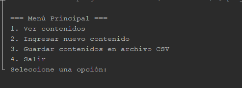
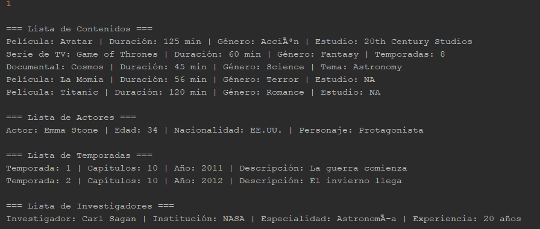
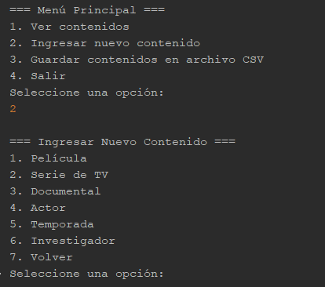
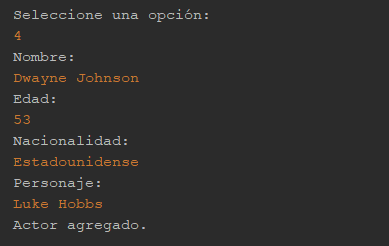
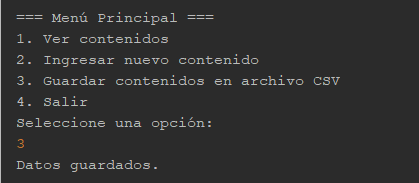
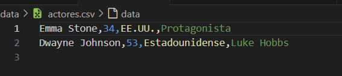
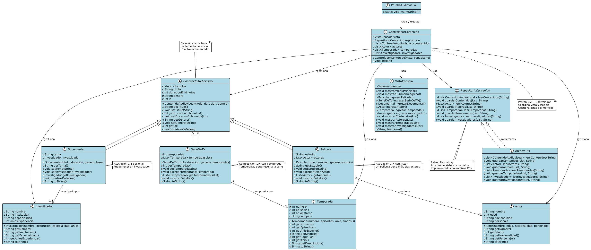

# Sistema de Gestión de Contenido Audiovisual

**Universidad Politécnica Salesiana**  
**Materia:** Programación Orientada a Objetos  
**Autor:** Mónica Guillermo

---

## Objetivo

Desarrollar un sistema en Java que permita gestionar películas, series y documentales, aplicando los principios de la programación orientada a objetos (POO), el patrón MVC y buenas prácticas como SOLID y pruebas unitarias.

---

## Descripción del Proyecto

La aplicación permite ingresar, visualizar y guardar información sobre películas, series de televisión y documentales, junto con sus elementos relacionados como actores, investigadores y temporadas. Toda la información se guarda y carga desde archivos CSV.  
Se estructura siguiendo el patrón Modelo-Vista-Controlador y usa Maven para su gestión y pruebas automáticas con JUnit.

---

## Funcionalidades principales

- Ingresar nuevas películas, series o documentales desde consola.
- Asociar actores a películas.
- Añadir temporadas a series.
- Relacionar investigadores a documentales.
- Guardar y cargar información usando archivos CSV.
- Visualizar el contenido mediante un menú en consola.
- Ejecutar pruebas unitarias para asegurar el correcto funcionamiento.

---

## Arquitectura del Proyecto

El sistema sigue el patrón **MVC**:

- **Modelo:** Clases como `Pelicula`, `SerieDeTV`, `Documental`, `Actor`, `Temporada` e `Investigador` representan los datos del sistema.
- **Vista:** `VistaConsola` gestiona la interacción con el usuario.
- **Controlador:** `ControladorContenido` coordina la lógica del sistema, conectando vista y modelo.

También se incluye una capa de **persistencia** basada en archivos CSV mediante las clases `RepositorioContenido` y `ArchivoUtil`.

---

## Pruebas (Test)

Se usó **JUnit** para verificar que las clases se comporten correctamente:

- `ActorTest`
- `PeliculaTest`
- `SerieDeTVTest`
- `DocumentalTest`
- `TemporadaTest`

---

## Maven

El proyecto usa Maven para compilar, ejecutar y empaquetar la aplicación. El archivo `pom.xml` incluye configuraciones para:

- Compilar el código Java.
- Ejecutar pruebas automáticas.
- Crear un archivo ejecutable `.jar`.

---

## Capturas del Sistema

### Menú principal  


### Ver contenido 


### Menú ingresar contenido 


### Ingresar Actor


### Guardar contenido en archivo CSV


### Archivo CSV


### Diagrama de Clases


---

## Instrucciones para clonar y ejecutar el proyecto

```bash
git clone https://github.com/mguillermoo/poo_unidad4.git
cd poo_unidad4
mvn clean install
mvn exec:java
